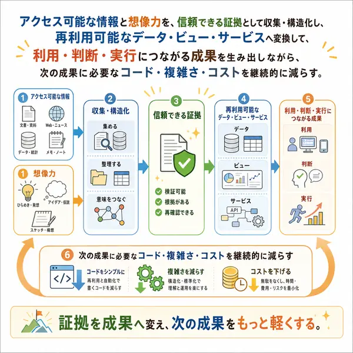

# KAFKA2306

実際に使うデータ、作業、記録、判断を、**後から根拠・状態・失敗まで追えて、もう一度使える形**へ変えるソフトウェアを作っています。

## Mission

**アクセス可能な情報と想像力を、信頼できる証拠として収集・構造化し、再利用可能なデータ・ビュー・サービスへ変換して、利用・判断・実行につながる成果を生み出しながら、次の成果に必要なコード・複雑さ・コストを継続的に減らす。**

## What I build

個別の技術stackではなく、次の性質を持つプロダクトを重視しています。

- 一次情報や取得時点へ戻れるデータ
- 現在値、snapshot、推定、AI生成を混同しないビュー
- 失敗や未検証を正常値で埋めないpipeline
- 実装しただけでなく、CI・実測・公開状態まで確認できる仕組み
- 同じ責務の入口やauthorityを増やさず、使いながら単純化できる構造

## Start here

| やりたいこと | 入口 |
|---|---|
| 投資・企業研究 | [investor2](https://github.com/KAFKA2306/investor2) · [semiconductor-earnings-model](https://github.com/KAFKA2306/semiconductor-earnings-model) |
| 個人財務 | [WealthAudit](https://github.com/KAFKA2306/WealthAudit) |
| VRChat・3D | [vlog](https://github.com/KAFKA2306/vlog) · [vrc_cast_event_calender](https://github.com/KAFKA2306/vrc_cast_event_calender) · [image2outfit](https://github.com/KAFKA2306/image2outfit) |
| 旅行 | [travel](https://github.com/KAFKA2306/travel) |
| ゲーム・趣味 | [rule-scribe-games](https://github.com/KAFKA2306/rule-scribe-games) · [game-library-dashboard](https://github.com/KAFKA2306/game-library-dashboard) |
| コンテンツ | [articles](https://github.com/KAFKA2306/articles) · [prompt-vault](https://github.com/KAFKA2306/prompt-vault) |
| Agent / Web運用 | [agent-resources](https://github.com/KAFKA2306/agent-resources) |

各projectの**現在の機能、データ、公開URL、CI、制約はowner repository側を確認してください**。このプロフィールREADMEでは、それらの状態を複製して台帳化しません。

## Design principles

- 技術の新しさより、何を判断しやすくなるかを優先する
- 出典・入力・処理・成果物・公開状態を追跡可能にする
- 実績、予測、推定、AI生成、人間判断を同じ事実として混ぜない
- 不明、未検証、失敗を隠さない
- public / private、canonical / snapshot、current / retired を分ける
- automationは手戻りを減らすために使い、検証可能性を失わない
- 実装と実証を分離しない

## Repository boundaries

このrepositoryの正準責務は**GitHubプロフィールの入口**です。公開portfolioの状態を別台帳として持たず、各owner repositoryへリンクします。

`scripts/` にはローカル運用向けの独立utilityが残っています。プロフィール本文の正準情報ではありません。utilityの継続配置・分離は、それぞれの実装と利用証拠を確認しながら段階的に整理します。
